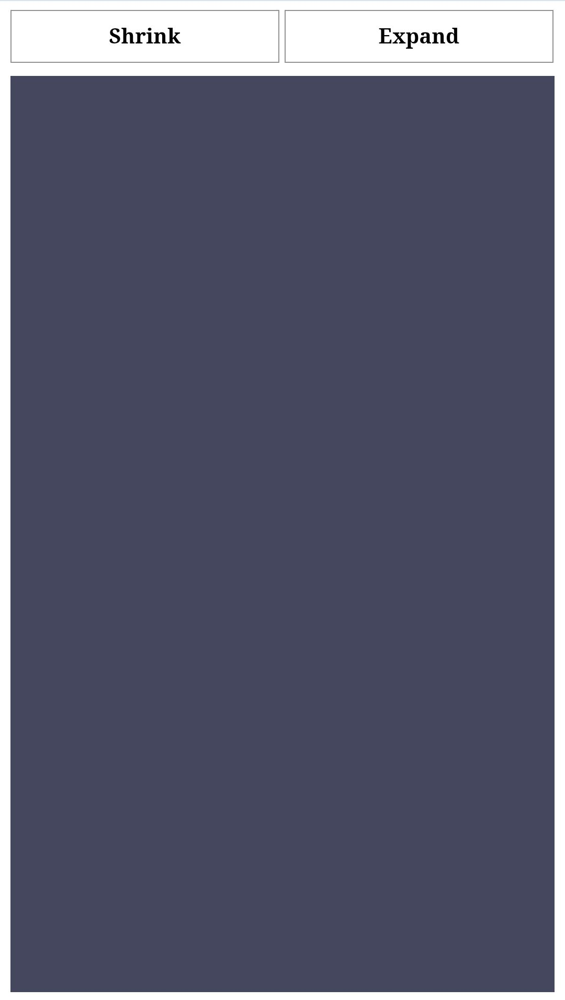

# Shrink & Expand

<a href="https://himanshhhyou.github.io/web-design/shrink-expand/shrink-expand.html">Preview</a>

<a href="https://himanshhhyou.github.io/web-design/shrink-expand/shrink-expand.html"></a>

## HTML

<a href="shrink-expand.html">shrink-expand.html</a>

```html
<!DOCTYPE html>
<html lang="en">

<head>
  <title>Shrink & Expand</title>
  
  <!-- External Stylesheet -->
  <link rel="stylesheet" href="shrink-expand.css">
</head>

<body>
  <!-- Radio buttons for shrink and expand -->
  <input type="radio" name="btn" id="shrink">
  <label for="shrink">Shrink</label>
  <input type="radio" name="btn" id="expand">
  <label for="expand">Expand</label>
  <!-- Container div for the effect -->
  <div></div>
</body>

</html>
```
## CSS

> Change the value of `transition: 2s;` to control the speed of expand and shrink.

<a href="shrink-expand.css">shrink-expand.css</a>

```css
   /* Hide the radio buttons */
   input {
     display: none;
   }

   /* Style for labels */
   label {
     display: inline-block;
     width: 100%;
     text-align: center;
     border: 1px solid #3F3F3F;
     padding: 10px 0;
     font-weight: 700;
     margin-bottom: 5px
   }

   /* Styling for the container */
   div {
     width: 100%;
     height: 700px;
     background-color: #585D70;
     transition: 2s;
   }

   /* Shrink effect when the #shrink radio is checked */
   #shrink:checked~div {
     height: 1px;
   }

   /* Expand effect when the #expand radio is checked */
   #expand:checked~div {
     height: 800px;
   }

   /* Button styling changes when #shrink radio is checked */
   #shrink:checked~label:nth-child(2) {
     background: #49B379;
     color: #fff;
   }

   /* Button styling changes when #expand radio is checked */
   #expand:checked~label:nth-child(4) {
     background: #49B379;
     color: #fff;
   }
```
