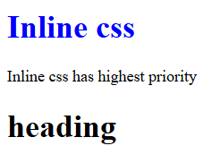
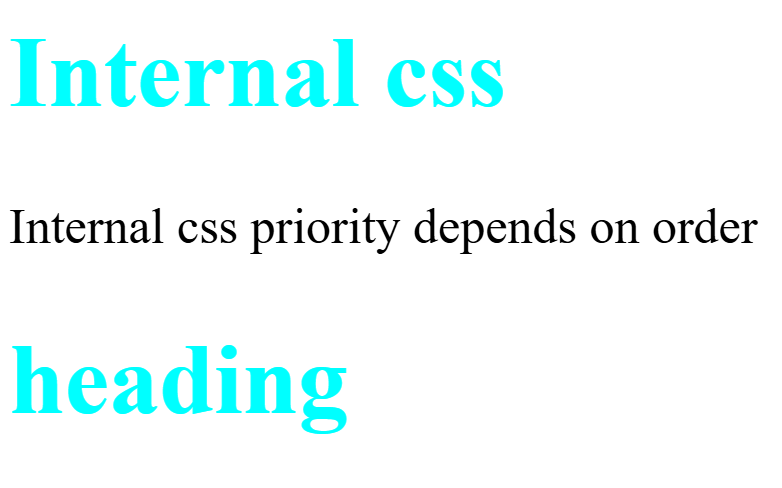
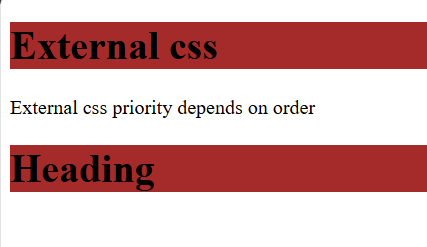

# Types Of CSS
 
## Inline CSS

[inline.html](#inline-css)

```html

<!DOCTYPE html>
<html>
<head>
    <title>Inline CSS</title>
</head>
<body>
   <h1 style="color: blue;">Inline css</h1>
   <p>Inline css has highest priority</p>
   <h1>Heading</h1>
</body>
</html>

```

## Output


## Internal CSS

[internal.html](#internal-css)
```html

<!DOCTYPE html>
<html>
<head>
    <title>Internal CSS</title>
    <style>
        h1{
            color: aqua;
        }
    </style>
</head>
<body>
    <h1>Internal css</h1>
   <p>Internal css priority depends on order</p>
   <h1>Heading</h1>
</body>
</html>

```

## Output


## External CSS

 [external.html](#external-css)
```html

<!DOCTYPE html>
<html>
<head>
    <title>External CSS</title>
    <link rel="stylesheet" href="style.css">
</head>
<body>
   <h1>External css</h1>
   <p>External css priority depends on order</p>
   <h1>Heading</h1>
</body>
</html>

```

[style.css](#external-css)

```css
h1{
    background-color: brown;
}
```


## Output
