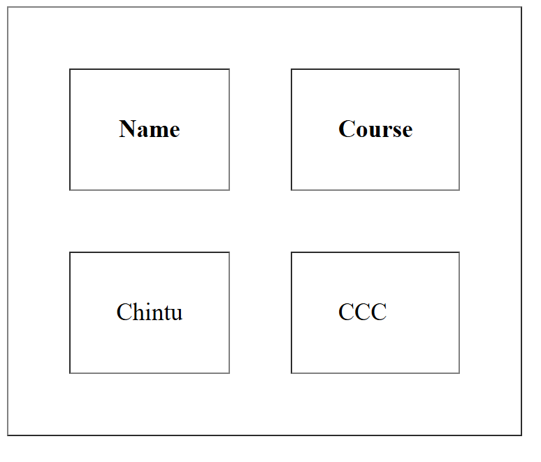

## Cellpadding and Cellspacing attribute
```html
<!DOCTYPE html>
<html>
<head>
    <title>Cellpadding and Cellspacing attribute</title>
</head>
<body>
    <table border="1" cellpadding="30px" cellspacing="40x">
        <tr>
            <th>Name</th>
            <th>Course</th>
        </tr>
        <tr>
            <td>Chintu</td>
            <td>CCC</td>
        </tr>
    </table>
</body>
</html>
```
## Output
