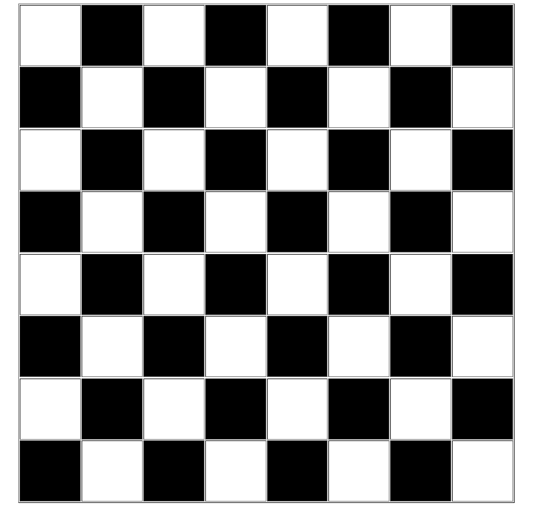

## Chess board

'''html
<!DOCTYPE html>
<html>
<head>
  <title>Chess board</title>
  
</head>
<body>
  <table border="2" align="center">
    <tr>
      <td bgcolor="black"></td>
      <td></td>
      <td bgcolor="black"></td>
      <td></td>
      <td bgcolor="black"></td>
      <td></td>
      <td bgcolor="black"></td>
      <td></td>
    </tr>
    <tr>
      <td></td>
      <td bgcolor="black"></td>
      <td></td>
      <td bgcolor="black"></td>
      <td></td>
      <td bgcolor="black"></td>
      <td></td>
      <td bgcolor="black"></td>
    </tr>
    <tr>
      <td bgcolor="black"></td>
      <td></td>
      <td bgcolor="black"></td>
      <td></td>
      <td bgcolor="black"></td>
      <td></td>
      <td bgcolor="black"></td>
      <td></td>
    </tr>
    <tr>
      <td></td>
      <td bgcolor="black"></td>
      <td></td>
      <td bgcolor="black"></td>
      <td></td>
      <td bgcolor="black"></td>
      <td></td>
      <td bgcolor="black"></td>
    </tr>
    <tr>
      <td bgcolor="black"></td>
      <td></td>
      <td bgcolor="black"></td>
      <td></td>
      <td bgcolor="black"></td>
      <td></td>
      <td bgcolor="black"></td>
      <td></td>
    </tr>
    <tr>
      <td></td>
      <td bgcolor="black"></td>
      <td></td>
      <td bgcolor="black"></td>
      <td></td>
      <td bgcolor="black"></td>
      <td></td>
      <td bgcolor="black"></td>
    </tr>
    <tr>
      <td bgcolor="black"></td>
      <td></td>
      <td bgcolor="black"></td>
      <td></td>
      <td bgcolor="black"></td>
      <td></td>
      <td bgcolor="black"></td>
      <td></td>
    </tr>
    <tr>
      <td></td>
      <td bgcolor="black"></td>
      <td></td>
      <td bgcolor="black"></td>
      <td></td>
      <td bgcolor="black"></td>
      <td></td>
      <td bgcolor="black"></td>
    </tr>
  </table>
</body>
</html>
'''

## Output

