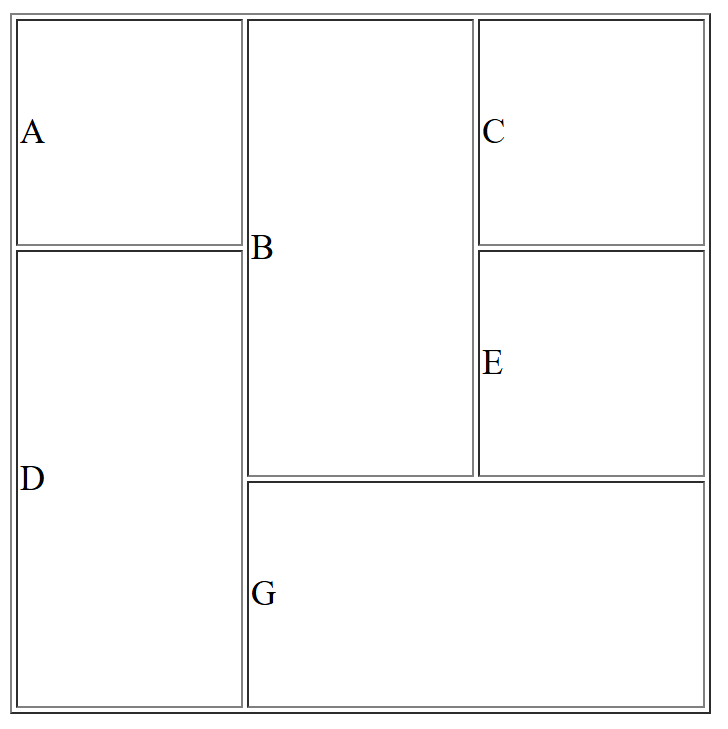

## Colspan & Rowspan 2
[colrow2.html](colrow2.html)
```html

<!DOCTYPE html>
<html>
	<head>
		<title>colrow2</title>
		<style>
			td{
				height: 100px;
				width: 100px;
			}
		</style>
	</head>
	<body>
		<table border="1">
			<tr>
				<td>A</td>
				<td rowspan="2">B</td>
				<td>C</td>
			</tr>
            <tr>
				<td rowspan="2">D</td>
				<td>E</td>
			</tr>
            <tr>        
				<td colspan="2">G</td>	
			</tr>
		</table>
	</body>
</html>
```

## Output
