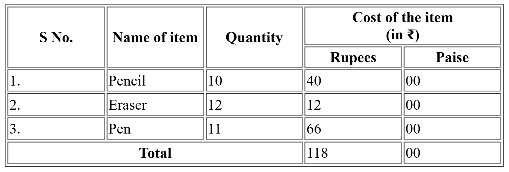

## Colspan & Rowspan 4
[colrow4.html](colrow4.html)
```html


<!DOCTYPE html>
<html>
	<head>
		<title>Rowspan and Colspan</title>
		<style>
			td{
				height: 20px;
				width: 100px;
			}
		</style>
	</head>
	<body>
		<table border="1">
			<tr>
				<th rowspan="2">S No.</th>
				<th rowspan="2">Name of item</th>
				<th rowspan="2">Quantity</th>
				<th colspan="2">Cost of the item<br>(in ₹)</th>
			</tr>
			<tr>
				<th>Rupees</th>
				<th>Paise</th>
			</tr>
			<tr>
				<td>1.</td>
				<td>Pencil</td>
				<td>10</td>
				<td>40</td>
				<td>00</td>
			</tr>
			<tr>
				<td>2.</td>
				<td>Eraser</td>
				<td>12</td>
				<td>12</td>
				<td>00</td>
			</tr>
			<tr>
				<td>3.</td>
				<td>Pen</td>
				<td>11</td>
				<td>66</td>
				<td>00</td>
			</tr>
			<tr>
				<td colspan="3"><center><b>Total</b></center></td>
				<td>118</td>
				<td>00</td>
			</tr>
		</table>
	</body>
</html>
	

```

## Output
