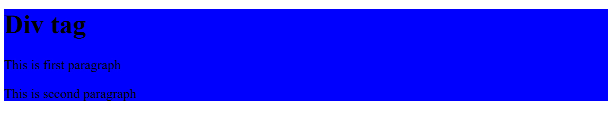

## Div Tag
```html
<!DOCTYPE html>
<html>
<head>
    <title>div tag</title>
    <style>
       div{
        background-color: blue;
       }
    </style>
</head>
<body>
    <div align="left">
        <h1>Div tag</h1>
        <p>This is first paragraph</p>
        <p>This is second paragraph</p>
    </div>
</body>
</html>
```
## Output

