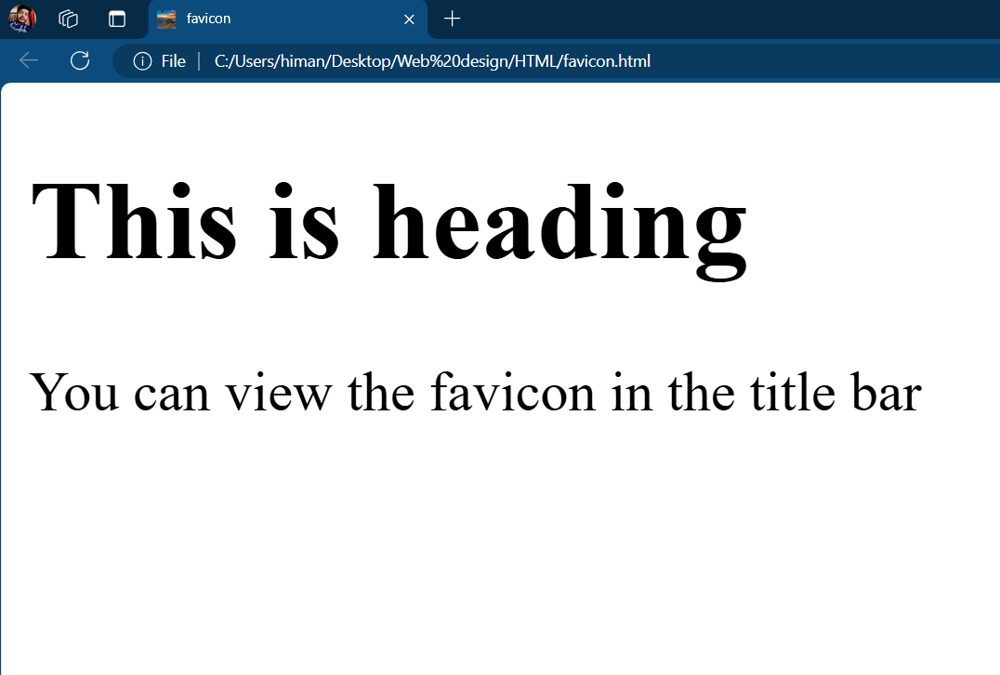

## Favicon

[favicon.html](favicon.html)
``` html
<!DOCTYPE html>
<html>
	<head>
		<title>favicon</title>
		<link rel="icon" href="images/sunset.jpg">
	</head>
	<body>
		<h1>This is heading</h1>
    <p>You can view the favicon in the title bar</p>
	</body>
</html>
```


## Output


