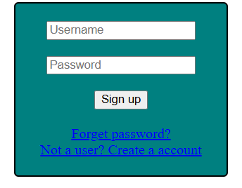

## Sign Up form

[signUp.html](signUp.html)

```html


<!DOCTYPE html>
<html>
	<head>
		<title>Form</title>
		<style>
			form{
				border: 2px solid black;
				border-radius: 5px;
				width: 200px;
				padding: 20px;
				background: teal;
			}
		</style>
	</head>
	<body>
		<center>
		<form>
			<input type="text" placeholder="Username"><br><br>
			<input type="password" placeholder="Password"><br><br>
			<input type="submit" value="Sign up"><br><br>
			<a href="#">Forget password?<a><br>
			<a href="#">Not a user? Create a account<a>
		</form>
		</center>
	</body>
</html>
```
## Output


