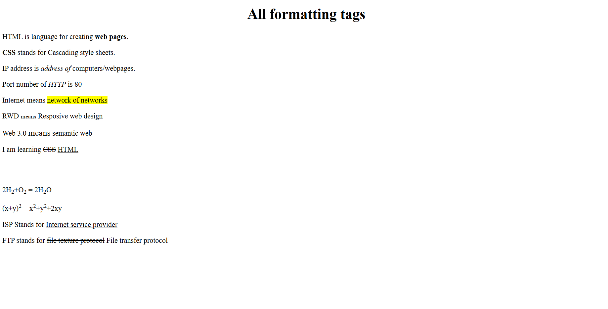

## Formatting tags
[formatting-tags.html](formatting-tags.html)

```html
<!DOCTYPE html>
<html>
	<head>
		<title>Formatting tag</title>
	</head>
	<body>
		<center><h1>All formatting tags</h1></center>
		<p>HTML is language for creating <b>web pages</b>.</p>

		<p><strong>CSS</strong> stands for Cascading style sheets.</p>

		<p>IP address is <i>address of</i> computers/webpages.</p>

		<p>Port number of <em>HTTP</em> is 80</p>

		<p>Internet means <mark>network of networks</mark></p>

		<p>RWD <small>means</small> Resposive web design</p>

		<p>Web 3.0 <big>means</big> semantic web</p>

		<p>I am learning <del>CSS</del> <ins>HTML</ins></p>

		<br><br>
		<p>2H<sub>2</sub>+O<sub>2</sub> = 2H<sub>2</sub>O</p>

		<p>(x+y)<sup>2</sup> = x<sup>2</sup>+y<sup>2</sup>+2xy</p>
		<p>ISP Stands for <u>Internet service provider</u></p>		
		<p>FTP stands for <strike>file texture protocol</strike> File transfer protocol</p>
	</body>
</html>
```

## Output

