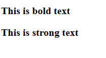
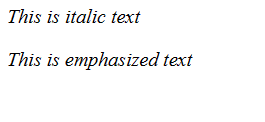

# Formatting Tags
## &lt;b> and &lt;strong>
``` html
<!DOCTYPE html>
<html>
    <head>
        <title>Formatting Tag</title>
    </head>
    <body>
        <p><b>This is bold text</b></p>
        <p><strong>This is strong text</strong></p>
    </body>
</html>
```
## Output


## &lt;i> and &lt;em>
```html
<!DOCTYPE html>
<html>
    <head>
        <title>Formatting Tag</title>
    </head>
    <body>
        <p><i>This is italic text</i></p>
        <p><em>This is emphasized text</em></p>
    </body>
</html>
```
## Output
