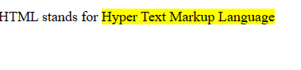
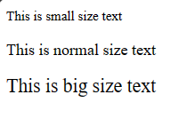

# Formatting Tags
## &lt;b> and &lt;strong>
``` html
<!DOCTYPE html>
<html>
    <head>
        <title>Formatting Tag</title>
    </head>
    <body>
        <p><b>This is bold text</b></p>
        <p><strong>This is strong text</strong></p>
    </body>
</html>
```
**Output:**
<!DOCTYPE  html>
<html>
    <body>
        <p><b>This is bold text</b></p>
        <p><strong>This is strong text</strong></p>
    </body>
</html>

## &lt;i> and &lt;em>
```html
<!DOCTYPE html>
<html>
      <head>
        <title>Formatting Tag</title>
    </head>
    <body>
        <p><i>This is italic text</i></p>
        <p><em>This is emphasized text</em></p>
    </body>
</html>
```
**Output:**
<!DOCTYPE html>
<html>
    <body>
        <p><i>This is italic text</i></p>
        <p><em>This is emphasized text</em></p>
    </body>
</html>

## &lt;mark>
```html
<!DOCTYPE html>
<html>
    <head>
        <title>Formatting Tags</title>
    </head>
    <body>
        <p>HTML stands for <mark>Hyper Text Markup Language</mark></p>
    </body>
</html>
```

**Output:**



## &lt;small> and &gt;big>
```html
<!DOCTYPE html>
<html>
    <head>
        <title>Formatting Tags</title>
    </head>
    <body>
        <small>This is small size text</small>
        <p>This is normal size text</p>
        <big>This is big size text</big>
    </body>
</html>
```
 **Output**



## &lt;del> and &lt;ins>
```html
<!DOCTYPE html>
<html>
    <head>
        <title>Formatting Tags</title>
    </head>
    <body>
       <p>I like <del>dogs</del> <ins>cats</ins></p>
    </body>
</html>
```
**Output**

<!DOCTYPE html>
<html>
    <body>
       <p>I like <del>dogs</del> <ins>cats</ins></p>
    </body>
</html>

## &lt;sub> and &lt;sup>
```html
<!DOCTYPE html>
<html>
    <head>
        <title>Formatting Tags</title>
    </head>
    <body>
       <p>Formula of water is: H<sub>2</sub>O</p>
       <p>2<sup>4</sup> = 16</p>
    </body>
</html>
```
**Output**

<!DOCTYPE html>
<html>
    <body>
       <p>Formula of water is: H<sub>2</sub>O</p>
       <p>2<sup>4</sup> = 16</p>
    </body>
</html>