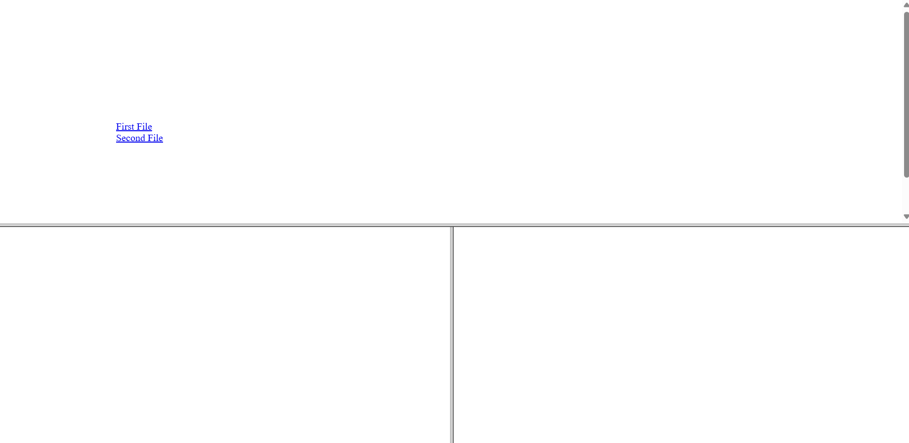

## Frameset 3
```html


<!DOCTYPE html>
<html>
	<head>
		<title>Frameset</title>
	</head>
	<frameset rows="*,*" noresize>
		<frame src="main.html" scrolling="auto" marginheight="200px" marginwidth="200px">
		<frameset cols="*,*">
			<frame name="s">
			<frame name="t" >
		</frameset>
	</frameset>
</html>


```

## Output
