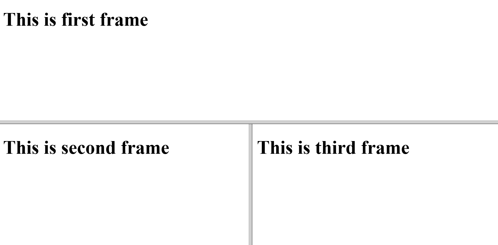

## Frameset 1

```html

<!DOCTYPE html>
<html>
	<head>
		<title>Frameset</title>
	</head>
	<frameset rows="*,*">
		<frame src="first.html">
		<frameset cols="*,*">
			<frame src="second.html">
			<frame src="third.html">
		</frameset>
	</frameset>
</html>
```

## Output
