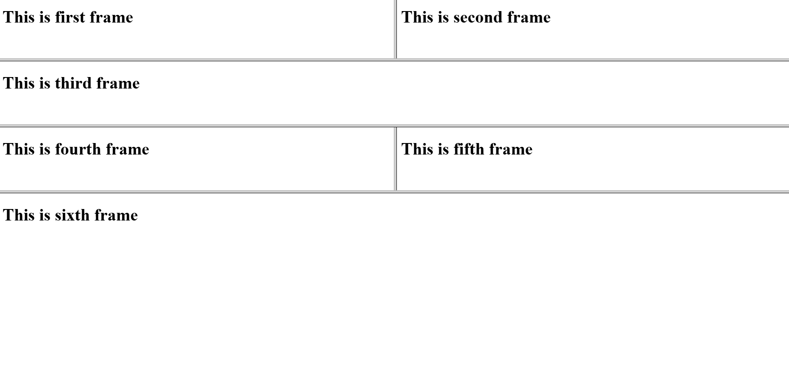

## Frameset 2
```html


<!DOCTYPE html>
<html>
	<head>
		<title>Frameset</title>
	</head>
	<frameset rows="16%,16%,16%,50%">
		<frameset cols="*,*">
			<frame src="first.html">
			<frame src="second.html">
		</frameset>

		<frame src="third.html">

		<frameset cols="*,*">
			<frame src="fourth.html">
			<frame src="fifth.html">
		</frameset>

		<frame src="sixth.html">
	</frameset>
		
</html>

```

## Output
