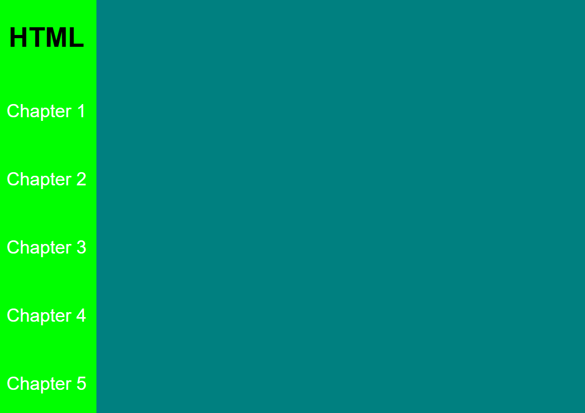

## Aside tag

```html

<!DOCTYPE html>
<html>
	<head>
		<title>Aside</title>
		<style>
			*{
				margin: 0;
				padding: 0;
				font-family: arial;
			}
			body{
				display: flex;
			}

			aside{
				background: lime;
				width: 100px;
				height: 100vh;
				display: flex;
				flex-direction: column;
				align-items: center;
				justify-content: space-around;
			}

			div{
				background: teal;
				width: 100%;
				height: 100vh;
			}
			a{
				text-decoration: none;
				color: white;
			}
		</style>
	</head>
	<body>
		<aside>
			<h1>HTML</h1>
			<a href="#">Chapter 1</a>
			<a href="#">Chapter 2</a>
			<a href="#">Chapter 3</a>
			<a href="#">Chapter 4</a>
			<a href="#">Chapter 5</a>
		</aside>
		<div>
		</div>
	</body>
</html>

```

## Output
