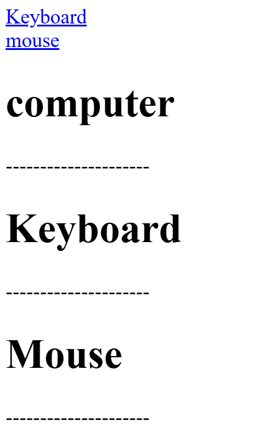

## Internal Link
```html

<!DOCTYPE html>
<html>
	<head>
		<title>Internal link</title>
	</head>
	<body>
		<a href="#kb">Keyboard</a><br>
		<a href="#mo">mouse</a>
		<h1>computer</h1>
		<p>---------------------</p>
		<h1 id="kb">Keyboard</h1>
		<p>---------------------</p>
		<h1 id="mo">Mouse</h1>
		<p>---------------------</p>
	</body>
</html>

```
## Output
