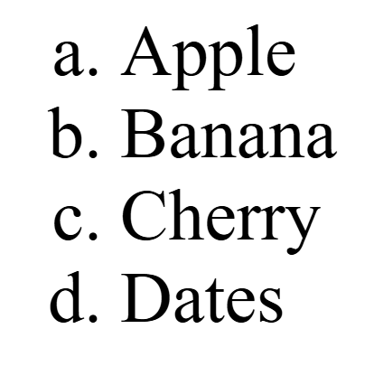

## Ordered List Type

```html
<!DOCTYPE html>
<html>
	<head>
		<title>Ordered List</title>
	</head>
	<body>
		<ol type="a">
			<!--a,A,1,i,I-->
			<li>Apple</li>
			<li>Banana</li>
			<li>Cherry</li>
			<li>Dates</li>
		</ol>
	</body>
</html>
```
## Output
