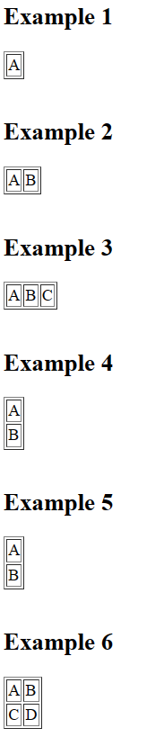

# Table Tag

```html
<!DOCTYPE html>
<html>
    <head>
        <title>Table Tag</title>
    </head>
    <body>
        <!-- Example 1 -->
        <h2>Example 1</h2>
        <table border="1">
            <tr>
                <td>A</td>
            </tr>
        </table><br>

        <h2>Example 2</h2>
        <!-- Example 2 -->
        <table border="1">
            <tr>
                <td>A</td>
                <td>B</td>
            </tr>
        </table><br>

        <h2>Example 3</h2>
        <!-- Example 3 -->
        <table border="1">
            <tr>
                <td>A</td>
                <td>B</td>
                <td>C</td>
            </tr>
        </table><br>

        <h2>Example 4</h2>
        <!-- Example 4 -->
        <table border="1">
            <tr>
                <td>A</td>
            </tr>
            <tr>
                <td>B</td>
            </tr>
        </table><br>

        <h2>Example 5</h2>
        <!-- Example 5 -->
        <table border="1">
            <tr>
                <td>A</td>
            </tr>
            <tr>
                <td>B</td>
            </tr>
        </table><br>

        <h2>Example 6</h2>
        <!-- Example 6 -->
        <table border="1">
            <tr>
                <td>A</td>
                <td>B</td>
            </tr>
            <tr>
                <td>C</td>
                <td>D</td>
            </tr>
        </table><br>
    </body>
</html>
```
## Output
