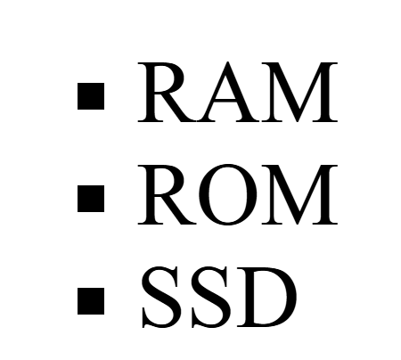

## Unordered list Type

```html

<!DOCTYPE html>
<html>
	<head>
		<title>Unordered list type</title>
	</head>
	<body>
		<!--disc, circle, square-->
		<ul type="square">
			<li>RAM</li>
			<li>ROM</li>
			<li>SSD</li>
		</ul>
	</body>
</html>

```
## Output
